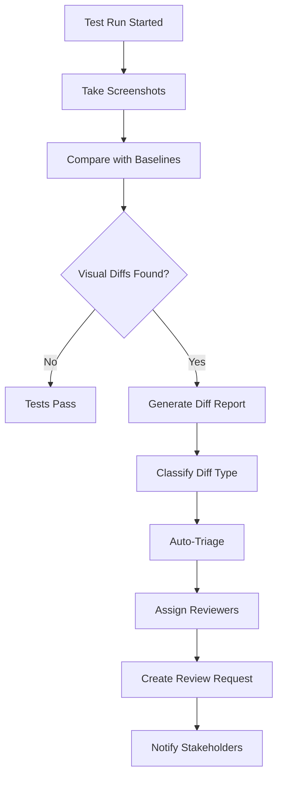

# Visual Regression Review Process & Tooling

## 🎯 Overview

This document establishes a comprehensive visual regression testing review process for Cloudlint, including automated triage, approval workflows, baseline management, and reviewer assignment automation to ensure UI consistency across releases.

## 📋 Visual Regression Review Workflow

### 1. **Automated Visual Diff Detection**



### 2. **Diff Classification System**

#### Automatic Classification Levels
```typescript
enum VisualDiffType {
  CRITICAL = 'critical',      // Major layout changes, broken UI
  SIGNIFICANT = 'significant', // Noticeable changes requiring review
  MINOR = 'minor',            // Small changes that may be acceptable  
  NOISE = 'noise'             // Rendering differences, anti-aliasing
}

interface VisualDiff {
  type: VisualDiffType
  confidence: number          // 0-100% confidence in classification
  affectedPixels: number      // Number of different pixels
  affectedAreas: Region[]     // Specific areas that changed
  similarityScore: number     // Overall similarity percentage
  changeDescription: string   // AI-generated description
  reviewRequired: boolean     // Whether human review is needed
}
```

#### Classification Rules
```yaml
classification_rules:
  critical:
    conditions:
      - similarity_score: < 80%
      - affected_pixels: > 50000
      - layout_shift: > 10px
      - missing_elements: true
    auto_reject: false
    requires_review: true
    reviewers: ['ui-lead', 'product-owner']
    
  significant:
    conditions:
      - similarity_score: 80-95%
      - affected_pixels: 10000-50000
      - color_changes: major
      - text_changes: true
    auto_reject: false
    requires_review: true
    reviewers: ['ui-developer', 'qa-lead']
    
  minor:
    conditions:
      - similarity_score: 95-98%
      - affected_pixels: 1000-10000
      - spacing_changes: < 5px
      - minor_color_shifts: true
    auto_reject: false
    requires_review: true
    reviewers: ['ui-developer']
    
  noise:
    conditions:
      - similarity_score: > 98%
      - affected_pixels: < 1000
      - anti_aliasing_only: true
      - rendering_differences: true
    auto_reject: false
    requires_review: false
    auto_approve: true
```

## 🔧 Automated Review Tooling

### Visual Diff Analysis Engine

```javascript
// visual-diff-analyzer.js
import { PixelDiff, ImageComparator } from 'playwright/test'

class VisualDiffAnalyzer {
  
  async analyzeScreenshotDiff(actualPath, expectedPath, diffPath) {
    const comparison = await ImageComparator.compare({
      actualPath,
      expectedPath,
      diffPath,
      threshold: 0.2,
      maxDiffPixels: 100
    })
    
    const analysis = {
      similarityScore: this.calculateSimilarity(comparison),
      affectedPixels: comparison.diffPixels,
      affectedAreas: await this.identifyAffectedAreas(comparison),
      changeType: await this.classifyChangeType(comparison),
      confidence: this.calculateConfidence(comparison)
    }
    
    const classification = this.classifyDiff(analysis)
    
    return {
      ...analysis,
      classification,
      reviewRequired: this.isReviewRequired(classification),
      autoApprovable: this.isAutoApprovable(classification)
    }
  }
  
  calculateSimilarity(comparison) {
    const totalPixels = comparison.width * comparison.height
    const changedPixels = comparison.diffPixels
    return ((totalPixels - changedPixels) / totalPixels) * 100
  }
  
  async identifyAffectedAreas(comparison) {
    // AI-powered region detection
    const regions = await this.detectChangedRegions(comparison.diffBuffer)
    
    return regions.map(region => ({
      x: region.x,
      y: region.y,
      width: region.width,
      height: region.height,
      changeType: this.classifyRegionChange(region),
      description: this.generateRegionDescription(region)
    }))
  }
  
  async classifyChangeType(comparison) {
    const features = await this.extractVisualFeatures(comparison)
    
    // Rule-based classification
    if (features.layoutShift > 10) return 'LAYOUT_CHANGE'
    if (features.colorChange > 0.3) return 'COLOR_CHANGE'  
    if (features.textChange) return 'TEXT_CHANGE'
    if (features.sizeChange > 0.1) return 'SIZE_CHANGE'
    if (features.positionChange > 5) return 'POSITION_CHANGE'
    
    return 'UNKNOWN_CHANGE'
  }
  
  classifyDiff(analysis) {
    const rules = this.getClassificationRules()
    
    for (const [level, rule] of Object.entries(rules)) {
      if (this.matchesRule(analysis, rule)) {
        return {
          type: level,
          confidence: analysis.confidence,
          autoAction: rule.auto_action || 'REVIEW_REQUIRED'
        }
      }
    }
    
    return { type: 'UNKNOWN', confidence: 0, autoAction: 'REVIEW_REQUIRED' }
  }
}
```

### Automated Review Assignment

```javascript
// review-assignment.js
class ReviewAssignmentEngine {
  
  async assignReviewers(visualDiff, changeContext) {
    const assignment = {
      primaryReviewers: [],
      secondaryReviewers: [],
      domain: this.identifyDomain(changeContext),
      priority: this.calculatePriority(visualDiff),
      deadline: this.calculateDeadline(visualDiff.classification.type)
    }
    
    // Assign based on diff classification
    switch (visualDiff.classification.type) {
      case 'CRITICAL':
        assignment.primaryReviewers = [
          await this.findAvailableReviewer('ui-lead'),
          await this.findAvailableReviewer('product-owner')
        ]
        assignment.priority = 'HIGH'
        break
        
      case 'SIGNIFICANT':
        assignment.primaryReviewers = [
          await this.findAvailableReviewer('ui-developer'),
          await this.findAvailableReviewer('qa-lead')  
        ]
        assignment.priority = 'MEDIUM'
        break
        
      case 'MINOR':
        assignment.primaryReviewers = [
          await this.findAvailableReviewer('ui-developer')
        ]
        assignment.priority = 'LOW'
        break
    }
    
    // Add domain experts
    const domainExperts = await this.findDomainExperts(assignment.domain)
    assignment.secondaryReviewers = domainExperts
    
    return assignment
  }
  
  identifyDomain(changeContext) {
    const path = changeContext.testPath || ''
    
    if (path.includes('/playground')) return 'playground'
    if (path.includes('/auth')) return 'authentication'
    if (path.includes('/admin')) return 'administration'
    if (path.includes('/mobile')) return 'mobile'
    
    return 'general'
  }
  
  async findAvailableReviewer(role) {
    const reviewers = await this.getReviewersByRole(role)
    const availableReviewers = await this.filterByAvailability(reviewers)
    
    // Round-robin assignment with workload balancing
    return this.selectReviewer(availableReviewers, 'round-robin')
  }
}
```

## 📊 Review Dashboard & Interface

### HTML Review Interface

```html
<!DOCTYPE html>
<html>
<head>
    <title>Visual Regression Review Dashboard</title>
    <meta charset="UTF-8">
    <meta name="viewport" content="width=device-width, initial-scale=1.0">
    <link href="https://cdn.jsdelivr.net/npm/tailwindcss@2.2.19/dist/tailwind.min.css" rel="stylesheet">
    <style>
        .diff-viewer {
            position: relative;
            display: inline-block;
        }
        
        .diff-overlay {
            position: absolute;
            top: 0;
            left: 0;
            opacity: 0.7;
            pointer-events: none;
        }
        
        .affected-area {
            position: absolute;
            border: 2px solid #ef4444;
            background-color: rgba(239, 68, 68, 0.2);
            pointer-events: all;
            cursor: pointer;
        }
        
        .comparison-slider {
            position: relative;
            overflow: hidden;
        }
        
        .comparison-handle {
            position: absolute;
            top: 0;
            bottom: 0;
            width: 2px;
            background: #3b82f6;
            cursor: ew-resize;
            z-index: 10;
        }
    </style>
</head>
<body class="bg-gray-100">
    <div class="container mx-auto px-4 py-8">
        <h1 class="text-3xl font-bold mb-8">Visual Regression Review</h1>
        
        <!-- Review Queue -->
        <div class="bg-white rounded-lg shadow mb-8">
            <div class="p-6 border-b">
                <h2 class="text-xl font-bold">Pending Reviews</h2>
                <div class="flex gap-4 mt-4">
                    <span class="bg-red-100 text-red-800 px-3 py-1 rounded-full text-sm">
                        Critical: <span id="critical-count">2</span>
                    </span>
                    <span class="bg-yellow-100 text-yellow-800 px-3 py-1 rounded-full text-sm">
                        Significant: <span id="significant-count">5</span>
                    </span>
                    <span class="bg-blue-100 text-blue-800 px-3 py-1 rounded-full text-sm">
                        Minor: <span id="minor-count">12</span>
                    </span>
                </div>
            </div>
            
            <div class="divide-y" id="review-queue">
                <!-- Review items populated by JavaScript -->
            </div>
        </div>
        
        <!-- Detailed Review Interface -->
        <div class="bg-white rounded-lg shadow" id="review-detail" style="display: none;">
            <div class="p-6 border-b">
                <div class="flex justify-between items-start">
                    <div>
                        <h2 class="text-xl font-bold" id="review-title">Visual Diff Review</h2>
                        <p class="text-gray-600" id="review-description"></p>
                    </div>
                    <div class="flex gap-2">
                        <span class="px-3 py-1 rounded-full text-sm" id="diff-classification"></span>
                        <span class="px-3 py-1 bg-gray-100 text-gray-800 rounded-full text-sm" id="similarity-score"></span>
                    </div>
                </div>
            </div>
            
            <!-- Diff Comparison -->
            <div class="p-6">
                <div class="grid grid-cols-1 lg:grid-cols-3 gap-6">
                    <!-- Expected (Baseline) -->
                    <div>
                        <h3 class="text-lg font-semibold mb-4">Expected (Baseline)</h3>
                        <div class="border rounded-lg overflow-hidden">
                            
                        </div>
                    </div>
                    
                    <!-- Actual (Current) -->
                    <div>
                        <h3 class="text-lg font-semibold mb-4">Actual (Current)</h3>
                        <div class="border rounded-lg overflow-hidden">
                            
                        </div>
                    </div>
                    
                    <!-- Diff Visualization -->
                    <div>
                        <h3 class="text-lg font-semibold mb-4">Differences</h3>
                        <div class="border rounded-lg overflow-hidden diff-viewer">
                            
                            <div id="affected-areas-overlay"></div>
                        </div>
                    </div>
                </div>
                
                <!-- Interactive Comparison Slider -->
                <div class="mt-6">
                    <h3 class="text-lg font-semibold mb-4">Interactive Comparison</h3>
                    <div class="comparison-slider border rounded-lg overflow-hidden" id="comparison-slider">
                        <div class="comparison-handle" id="comparison-handle" style="left: 50%;"></div>
                        <canvas id="comparison-canvas"></canvas>
                    </div>
                </div>
                
                <!-- Analysis Results -->
                <div class="mt-6">
                    <h3 class="text-lg font-semibold mb-4">Analysis Results</h3>
                    <div class="grid grid-cols-2 md:grid-cols-4 gap-4">
                        <div class="bg-gray-50 p-4 rounded-lg">
                            <div class="text-2xl font-bold text-blue-600" id="affected-pixels">0</div>
                            <div class="text-gray-600">Affected Pixels</div>
                        </div>
                        <div class="bg-gray-50 p-4 rounded-lg">
                            <div class="text-2xl font-bold text-green-600" id="similarity-percentage">0%</div>
                            <div class="text-gray-600">Similarity</div>
                        </div>
                        <div class="bg-gray-50 p-4 rounded-lg">
                            <div class="text-2xl font-bold text-purple-600" id="affected-regions">0</div>
                            <div class="text-gray-600">Changed Areas</div>
                        </div>
                        <div class="bg-gray-50 p-4 rounded-lg">
                            <div class="text-2xl font-bold text-orange-600" id="confidence-score">0%</div>
                            <div class="text-gray-600">Confidence</div>
                        </div>
                    </div>
                </div>
                
                <!-- Affected Areas Details -->
                <div class="mt-6">
                    <h3 class="text-lg font-semibold mb-4">Affected Areas</h3>
                    <div class="space-y-2" id="affected-areas-list">
                        <!-- Populated by JavaScript -->
                    </div>
                </div>
                
                <!-- Review Actions -->
                <div class="mt-6 flex gap-4">
                    <button class="bg-green-600 hover:bg-green-700 text-white px-6 py-2 rounded-lg" onclick="approveChange()">
                        ✅ Approve Change
                    </button>
                    <button class="bg-red-600 hover:bg-red-700 text-white px-6 py-2 rounded-lg" onclick="rejectChange()">
                        ❌ Reject Change
                    </button>
                    <button class="bg-blue-600 hover:bg-blue-700 text-white px-6 py-2 rounded-lg" onclick="updateBaseline()">
                        🔄 Update Baseline
                    </button>
                    <button class="bg-gray-600 hover:bg-gray-700 text-white px-6 py-2 rounded-lg" onclick="requestMoreInfo()">
                        ❓ Request More Info
                    </button>
                </div>
                
                <!-- Review Comments -->
                <div class="mt-6">
                    <h3 class="text-lg font-semibold mb-4">Review Comments</h3>
                    <textarea class="w-full p-3 border rounded-lg" rows="4" placeholder="Add your review comments here..." id="review-comments"></textarea>
                </div>
            </div>
        </div>
    </div>
    
    <script>
        // Interactive review interface JavaScript
        let currentReview = null;
        
        function loadReviewQueue() {
            // Fetch pending reviews from API
            fetch('/api/visual-reviews/pending')
                .then(response => response.json())
                .then(reviews => {
                    displayReviewQueue(reviews);
                });
        }
        
        function displayReviewQueue(reviews) {
            const queue = document.getElementById('review-queue');
            queue.innerHTML = '';
            
            reviews.forEach(review => {
                const reviewItem = createReviewQueueItem(review);
                queue.appendChild(reviewItem);
            });
            
            updateCounters(reviews);
        }
        
        function createReviewQueueItem(review) {
            const item = document.createElement('div');
            item.className = 'p-4 hover:bg-gray-50 cursor-pointer';
            item.onclick = () => openReview(review.id);
            
            item.innerHTML = `
                <div class="flex justify-between items-start">
                    <div>
                        <h3 class="font-semibold">${review.testName}</h3>
                        <p class="text-gray-600">${review.description}</p>
                        <div class="flex gap-2 mt-2">
                            <span class="text-sm text-gray-500">${review.timestamp}</span>
                            <span class="text-sm text-gray-500">${review.affectedPixels} pixels changed</span>
                        </div>
                    </div>
                    <div class="text-right">
                        <span class="classification-badge ${review.classification.type.toLowerCase()}">${review.classification.type}</span>
                        <div class="text-sm text-gray-500 mt-1">${review.similarity}% similar</div>
                    </div>
                </div>
            `;
            
            return item;
        }
        
        function openReview(reviewId) {
            fetch(`/api/visual-reviews/${reviewId}`)
                .then(response => response.json())
                .then(review => {
                    displayReviewDetail(review);
                    currentReview = review;
                });
        }
        
        function displayReviewDetail(review) {
            document.getElementById('review-detail').style.display = 'block';
            document.getElementById('review-title').textContent = review.testName;
            document.getElementById('review-description').textContent = review.description;
            
            // Load screenshots
            document.getElementById('expected-screenshot').src = review.screenshots.expected;
            document.getElementById('actual-screenshot').src = review.screenshots.actual;
            document.getElementById('diff-screenshot').src = review.screenshots.diff;
            
            // Update analysis data
            document.getElementById('affected-pixels').textContent = review.analysis.affectedPixels.toLocaleString();
            document.getElementById('similarity-percentage').textContent = review.analysis.similarityScore.toFixed(1) + '%';
            document.getElementById('affected-regions').textContent = review.analysis.affectedAreas.length;
            document.getElementById('confidence-score').textContent = review.analysis.confidence.toFixed(1) + '%';
            
            // Display affected areas
            displayAffectedAreas(review.analysis.affectedAreas);
            
            // Setup interactive comparison
            setupInteractiveComparison(review.screenshots);
        }
        
        function displayAffectedAreas(areas) {
            const list = document.getElementById('affected-areas-list');
            list.innerHTML = '';
            
            areas.forEach(area => {
                const areaItem = document.createElement('div');
                areaItem.className = 'bg-gray-50 p-3 rounded-lg';
                areaItem.innerHTML = `
                    <div class="flex justify-between items-center">
                        <div>
                            <span class="font-medium">${area.changeType}</span>
                            <span class="text-gray-600 ml-2">${area.description}</span>
                        </div>
                        <div class="text-sm text-gray-500">
                            ${area.width}×${area.height} at (${area.x}, ${area.y})
                        </div>
                    </div>
                `;
                list.appendChild(areaItem);
            });
        }
        
        function setupInteractiveComparison(screenshots) {
            const canvas = document.getElementById('comparison-canvas');
            const handle = document.getElementById('comparison-handle');
            const slider = document.getElementById('comparison-slider');
            
            // Implementation for interactive before/after slider
            // This would involve canvas manipulation for overlay comparison
        }
        
        function approveChange() {
            if (!currentReview) return;
            
            const comments = document.getElementById('review-comments').value;
            
            fetch(`/api/visual-reviews/${currentReview.id}/approve`, {
                method: 'POST',
                headers: { 'Content-Type': 'application/json' },
                body: JSON.stringify({ comments })
            }).then(() => {
                alert('Change approved!');
                loadReviewQueue();
                hideReviewDetail();
            });
        }
        
        function rejectChange() {
            if (!currentReview) return;
            
            const comments = document.getElementById('review-comments').value;
            if (!comments.trim()) {
                alert('Please provide comments when rejecting a change.');
                return;
            }
            
            fetch(`/api/visual-reviews/${currentReview.id}/reject`, {
                method: 'POST',
                headers: { 'Content-Type': 'application/json' },
                body: JSON.stringify({ comments })
            }).then(() => {
                alert('Change rejected!');
                loadReviewQueue();
                hideReviewDetail();
            });
        }
        
        function updateBaseline() {
            if (!currentReview) return;
            
            if (confirm('Are you sure you want to update the baseline? This will make the current screenshot the new expected result.')) {
                fetch(`/api/visual-reviews/${currentReview.id}/update-baseline`, {
                    method: 'POST'
                }).then(() => {
                    alert('Baseline updated!');
                    loadReviewQueue();
                    hideReviewDetail();
                });
            }
        }
        
        function hideReviewDetail() {
            document.getElementById('review-detail').style.display = 'none';
            currentReview = null;
        }
        
        // Initialize on page load
        document.addEventListener('DOMContentLoaded', loadReviewQueue);
    </script>
</body>
</html>
```

## 🔄 Baseline Management System

### Automated Baseline Updates

```yaml
# .github/workflows/visual-baseline-management.yml
name: Visual Baseline Management

on:
  pull_request:
    types: [closed]
  workflow_dispatch:
    inputs:
      update_type:
        description: 'Type of baseline update'
        required: true
        default: 'selective'
        type: choice
        options:
        - selective
        - full
        - rollback

jobs:
  update-baselines:
    if: github.event.pull_request.merged == true || github.event_name == 'workflow_dispatch'
    runs-on: ubuntu-latest
    steps:
      - uses: actions/checkout@v3
        with:
          fetch-depth: 0
          
      - name: Setup Node.js
        uses: actions/setup-node@v3
        with:
          node-version: '20'
          cache: 'npm'
          
      - name: Install dependencies
        run: npm ci
        
      - name: Install Playwright
        run: npx playwright install --with-deps
        
      - name: Update Visual Baselines
        run: |
          if [ "${{ github.event.inputs.update_type }}" = "full" ]; then
            npm run test:visual -- --update-snapshots
          elif [ "${{ github.event.inputs.update_type }}" = "rollback" ]; then
            npm run test:visual:rollback
          else
            npm run test:visual:update-approved
          fi
        env:
          CI: true
          
      - name: Commit Updated Baselines
        run: |
          git config user.name "Visual Baseline Bot"
          git config user.email "visual-baselines@cloudlint.dev"
          
          if [ -n "$(git diff --name-only)" ]; then
            git add test-results/
            git commit -m "chore: update visual baselines after PR merge
            
            Updated baselines for approved visual changes in PR #${{ github.event.pull_request.number }}"
            git push origin main
          fi
          
      - name: Create Baseline Update Report
        run: |
          npm run test:visual:generate-baseline-report
          
      - name: Upload Baseline Report
        uses: actions/upload-artifact@v3
        with:
          name: baseline-update-report
          path: reports/visual-baseline-update-report.html
```

## 📈 Review Metrics & Analytics

### Review Performance Dashboard

```json
{
  "review_metrics": {
    "period": "last_30_days",
    "total_reviews": 156,
    "avg_review_time": "4.2 hours",
    "approval_rate": "78%",
    "false_positive_rate": "12%",
    "reviewer_performance": {
      "ui-lead": {
        "reviews_completed": 45,
        "avg_review_time": "2.1 hours",
        "approval_accuracy": "95%"
      },
      "ui-developer": {
        "reviews_completed": 89,
        "avg_review_time": "3.8 hours", 
        "approval_accuracy": "87%"
      }
    },
    "diff_type_breakdown": {
      "critical": { "count": 12, "avg_review_time": "6.8 hours" },
      "significant": { "count": 34, "avg_review_time": "4.5 hours" },
      "minor": { "count": 78, "avg_review_time": "2.1 hours" },
      "noise": { "count": 32, "auto_approved": 28 }
    }
  }
}
```

## ✅ Process Guidelines & Best Practices

### Review Decision Matrix

| Diff Type | Affected Pixels | Similarity | Action Required |
|-----------|----------------|------------|-----------------|
| Critical | >50,000 | <80% | Mandatory UI Lead + Product Owner review |
| Significant | 10,000-50,000 | 80-95% | UI Developer + QA Lead review |
| Minor | 1,000-10,000 | 95-98% | UI Developer review |
| Noise | <1,000 | >98% | Auto-approve if rendering differences only |

### Review SLAs

- **Critical Changes**: 4 hours
- **Significant Changes**: 24 hours  
- **Minor Changes**: 48 hours
- **Noise**: Auto-processed

### Escalation Process

1. **Initial Review**: Assigned reviewers have first opportunity
2. **Escalation Trigger**: No response within SLA timeframe
3. **Auto-Escalation**: Notify team lead and create GitHub issue
4. **Final Escalation**: Product owner notification for critical changes

---

This comprehensive visual regression review process ensures systematic, efficient, and accurate handling of UI changes while maintaining high quality standards and clear accountability.